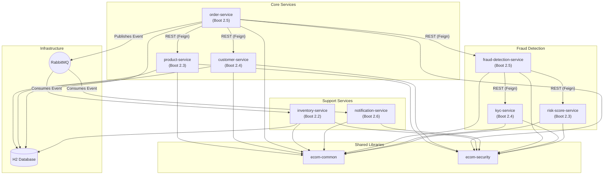
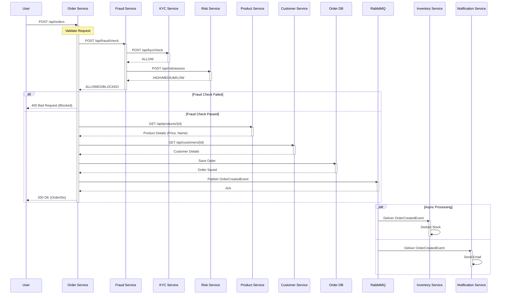

# E-Commerce Microservices Demo

This workspace demonstrates a legacy e-commerce system composed of multiple independent Maven projects. It is designed to showcase manual or automated upgrade processes for Spring Boot and Java applications.

## Services Overview

| Service | Spring Boot Version | Port | Description |
| :--- | :--- | :--- | :--- |
| **`product-service`** | 2.3.12.RELEASE | 8080 | Manages the product catalog. Exposes REST endpoints. |
| **`customer-service`** | 2.4.13 | 8081 | Manages customer profiles. Exposes REST endpoints. |
| **`order-service`** | 2.5.15 | 8082 | Handles order placement. Orchestrates calls to Product and Customer services and publishes events. |
| **`inventory-service`** | 2.2.13.RELEASE | 8083 | Tracks stock levels. Listens to `OrderCreatedEvent` to deduct inventory. |
| **`notification-service`** | 2.6.15 | 8084 | Sends notifications (email/SMS). Listens to `OrderCreatedEvent`. |
| **`kyc-service`** | 2.4.13 | 8085 | Performs background checks (Mocked: Always Allow). |
| **`risk-score-service`** | 2.3.12.RELEASE | 8086 | Calculates risk score using Drools rules. |
| **`fraud-detection-service`** | 2.5.15 | 8087 | Orchestrates fraud checks by calling KYC and Risk services. |

### Shared Libraries

-   **`ecom-common`**: Contains shared DTOs (e.g., `OrderCreatedEvent`, `ApiResponse`), utilities, and exceptions.
-   **`ecom-security`**: Provides standardized Spring Security configuration and JWT utilities.

### Legacy Dependencies

-   **QueryDSL 3.2.3**: Used for persistence layer type-safe queries in all services. Configured with `apt-maven-plugin`.

## System Architecture

The system follows a microservices architecture with both synchronous (REST) and asynchronous (RabbitMQ) communication.



## Information Flow: Order Creation

When a user places an order, the `order-service` orchestrates the process.



## Running with Docker

You can run the entire system using Docker Compose:

```bash
# Build all images and start services
docker-compose up --build
```

This will start all 8 services and RabbitMQ. The services will be available at their respective ports (e.g., `product-service` at 8080, `order-service` at 8082).

## Testing the System

You can use the following `curl` commands to test the system and generate traces in Jaeger.

### 1. Create a Product
```bash
curl -X POST http://localhost:8080/products \
-H "Content-Type: application/json" \
-d '{"name": "Laptop", "description": "High-end laptop", "price": 1200.00}'
```

### 2. Create a Customer
```bash
curl -X POST http://localhost:8081/customers \
-H "Content-Type: application/json" \
-d '{"name": "John Doe", "email": "john.doe@example.com"}'
```

### 3. Place an Order (Success)
This order should pass fraud checks (Amount >= 1000 is Low Risk).
```bash
curl -X POST http://localhost:8082/orders \
-H "Content-Type: application/json" \
-d '{"customerId": 1, "productIds": [1]}'
```

### 4. Place an Order (Fraud Rejected)
This order should fail fraud checks if the amount is < 1000 (Medium/High Risk) or if KYC fails.
*Note: Since we only have one product priced at 1200, you might need to create a cheaper product to trigger risk rules.*

### 5. View Traces
Open Jaeger UI at [http://localhost:16686](http://localhost:16686) to view the distributed traces.

## Building the Workspace

Each project is independent. To build everything:

```bash
# Build shared libs first
(cd ecom-common && mvn clean install)
(cd ecom-security && mvn clean install)

# Build services
(cd product-service && mvn clean install)
(cd customer-service && mvn clean install)
(cd order-service && mvn clean install)
(cd inventory-service && mvn clean install)
(cd notification-service && mvn clean install)
```
